<h1 align="center">  </h1>

  

<h3 align="center"> Hi 👋, I'm LoCo (Hossein) </h3>

A passionate developer from Iran

<a href="https://loco81.ir?lang=en">*Click here to visit my website*</a>

 

 

- 🔭 I’m currently working on [Comizo]

- 🌱 I’m currently learning **Django**

- 👯 I’m looking to collaborate on **Flutter, Python**

- 👨‍💻 All of my projects are available at [My website](https://loco81.ir?lang=en)

- 💬 Ask me about **Flutter, Python, Front-end**

- 📫 How to reach me **https://loco81.ir/contact, hosseinbahiraei81@gmail.com**

- 📄 Know about my experiences at [My works](https://loco81.ir/skills?lang=en)

- ⚡ a fact ** I think my life is tied to programming💻, music🎵, and the world of cars🏎️.**
 

<h3 align="left">Connect with me:</h3>

 

<h3 align="left">Languages and Tools:</h3>

        

 
 

<!-- <h3><code>LoCo@github ~ $ ./contributions.sh</code></h3>

   -->

<h3><code>LoCo@github ~ $ whoami</code></h3>

 

<h3><code>LoCo@github ~ $ cat contact.txt</code></h3>

  
  
  <!--  -->
  
  

 

<code>contrib-heatmap.svg</code> is re-scraped and re-rendered every day by <a href="./.github/workflows/update-profile-art.yml">a GitHub Action</a>. Everything above is generated by <a href="./scripts">scripts in this repo</a> — no third-party stats service, nothing to rate-limit, nothing to 404.

  

<a href="./SETUP.md"><strong>Use this profile style →</strong></a>

